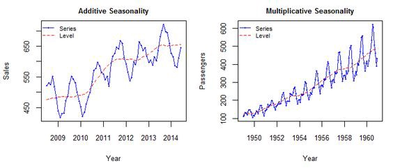

```{r setup, include=FALSE}
knitr::opts_chunk$set(echo = TRUE)
options(scipen = 10)
```


# Intro 

Time series. A time series is simply a series of data points ordered in time. In a time series, time is often the independent variable and the goal is usually to make a forecast for the future.   

Time series data often arise when monitoring industrial processes or tracking corporate business metrics. The essential difference between modeling data via time series methods or using the process monitoring methods

Time series analysis comprises methods for analyzing time series data in order to extract meaningful statistics and other characteristics of the data. Time series forecasting is the use of a model to predict future values based on previously observed values.   

While regression analysis is often employed in such a way as to test theories that the current values of one or more independent time series affect the current value of another time series, this type of analysis of time series is not called "time series analysis", which focuses on comparing values of a single time series or multiple dependent time series at different points in time. Interrupted time series analysis is the analysis of interventions on a single time series.

Time Series Analysis is used for many applications such as:   

1. Economic Forecasting   
2. Sales Forecasting   
3. Budgetary Analysis   
4. Stock Market Analysis   
5. Yield Projections   
6. Process and Quality Control   
7. Inventory Studies   
8. Workload Projections   
9. Utility Studies   
10. Census Analysis   

and many, many more...   

## Background 

In this case we will try to use 3 Modelling of Time Series and make predictions based on model. 

1. Moving average   
2. Exponential smoothing   
3. ARIMA   

In the end we will compare Mean Absolute Percentage Error from result of forecasting from each time series model.

## Import Library

```{r message=FALSE}
# Library for data Processing
library(tidyverse)
# Library to forecast
library(forecast)
# Library for Processing date data type
library(lubridate)
# Library Simple Moving Average
library(TTR)
# Library MAPE
library(MLmetrics)
# Library for Processing date data type
library(zoo)
# Data visualisation
library(plotly)
library(xts)
library(TSstudio)
library(tseries)
```

## Dataset

In this case we will use `tsdl` The Time Series Data Library package. This package contain time series data from a lot of subject. Data provide on this package already convert as Time Series object. 

```{r}
library(tsdl)
```

Check kind of subject inside the Data Library

```{r}
tsdl
```

In this case i will use `Sales` data with Frequency 12 or Monthly. We need to subset it

```{r}
sales <- subset(tsdl, 'sales', 12)
sales <- sales[[24]]
```

```{r}
head(sales)
```

# Data Wrangling 

Time Series data we get from `tsdl` before we will check whether there is NA inside data.


```{r}
# Length of data 
length(sales)
# NA check
table(is.na(sales))
```

We can see total length of data 64 and we get FALSE 64, it means data has no NA. Not only NA we should check, we try to know how distribution from our time series data. we can use `summary` syntax to know distribution of our data.


```{r}
summary(sales)
```

Min of our time series data is 48.0 it means our data dont have 0 value. 

From `tsdl` package data we get it already an TS object. These are vectors or matrices with class of "ts" (and additional attributes) which represent data which has been sampled at equispaced points in time. In the matrix case, each column of the matrix data is assumed to contain a single (univariate) time series. Time series must have at least one observation, and although they need not be numeric there is very limited support for non-numeric series.

I will try to reverse it to data frame, it can help us to visualize data later. 

```{r}
sales_df <- data.frame(Y = as.matrix(sales), date = as_date(yearmon(time(sales))))
```

# Exploratory Data Analysis

I this sub part, i will try to explore our timeseries object. We will try to understand more our object, whether we can found trend, seasonal, or other interpretation or insight based on visualisastion.   

## Additive or Multiplicative 

There are basically two methods to analyze the seasonality of a Time Series: additive and multiplicative. and to categorize Time Series object there is 3 main components which will be calculated for forecasting. These components are:   

1. trend (T): the movement of mean, globally, throughout an interval.   
2. seasonal (S): the pattern captured on each seasonal interval.   
3. error (E): the pattern/value that cannot be captured by both trend and seasonal.

### Additive Model

Synthetically it is a model of data in which the effects of the individual factors are differentiated and added to model the data. It can be represented by:   

$y(t) = Trend + Seasonality + Noise$   

In the additive model, the behavior is linear where changes over time are consistently made by the same amount, like a linear trend. In this situation, the linear seasonality has the same amplitude and frequency.   

### Multiplicative Model

In this situation, trend and seasonal components are multiplied and then added to the error component. It is not linear, can be exponential or quadratic and represented by a curved line as below:   

$y(t) = Trend * Seasonality * Noise$   

Different from the additive model, the multiplicative model has an increasing or decreasing amplitude and/or frequency over time.

These charts can summarize [Additive Model] and [Multiplicative Model]

```{r fig.align="center", echo=FALSE}

```

Next we will try visualize our timeseries object to know either its multiplicative or additive

```{r}
ggplotly(
  sales %>% as.xts() %>%  autoplot() + theme_bw()
) 
```

Based on chart we can say our data is Multiplicative because it show the behavior acts as an increasing funnel.

## Decompose

In this part we will try decompose data, which mean we will try to seperate 3 components: Tremd, Seasonality and Error

```{r}
sales_deco <- decompose(sales, type = "multiplicative")
```

Visualise trend data 

```{r}
sales_deco$trend %>% autoplot()
```

We found that our trand already smooth and there isn't another seasonality shows in the line, so it mean our seasonal and frequency setup in `ts` object has fitted well and we can call it single seasonal.   

next, visualise seasonal   

```{r}
sales_deco$seasonal %>% autoplot()
```

we can said our decompose catch seasonal pattern well, because it show repeating pattern with a fixed period of time / same. we can try inteprate more based on seasonal, lets try processing the data.

```{r}
sales_df %>% 
  mutate(
    seasonal = sales_deco$seasonal,
    date = month(ymd(date), label = T, abbr = F)
  ) %>% 
  distinct(date, seasonal) %>% 
  ggplot(mapping = aes(x = date, y = seasonal)) +
  geom_col() +
  theme_bw()
```

Based on plot, we can assume sales start increasing start from january until middle year, and will decreasing start from middle year until december.

## Cross Validation

The cross-validation scheme for time series should not be sampled randomly, but splitted sequentially. in this case we would take 12 last data as test data and keep rest data as train data

```{r}
sales_train <- head(sales, length(sales) - 12)
sales_test <- tail(sales, 12)

```

## Model BUilding

### Simple Moving Average

The moving average model is probably the most naive approach to time series modelling. This model simply states that the next observation is the mean of all past observations.   

```{r}
sales_sma <- SMA(x = sales_train, n = 6)
```

```{r}
sales_sma
```

```{r warning=FALSE}
autoplot(sales_train) + 
  autolayer(sales_sma) + 
  theme_minimal()
```

In the plot above, we applied the moving average model to a monthly window. The red line is smoothed the time series. We already have SMA model and we will forecast using `forecast` and length data we guess is length from our [sales_test] data.

```{r warning=FALSE}
sales_sma_forecast <- forecast(sales_sma, h = length(sales_test))
```

We try to plot it, as we know this model will smooth historycal data in the end it will use to forecast. we can plot it like this

```{r}
plot_forecast(sales_sma_forecast)
```

however plot above observant is from model, we can see real data compare with our forecast.

```{r}
sales_train %>% autoplot() +
  autolayer(sales_sma_forecast) +
  theme_bw()
```

Last we can compare our forcasting data with our test data, and we evaluate it using MAPE, we found that our Error is around 31.2%


```{r}
result <- MAPE(y_pred = sales_sma_forecast$mean, y_true = sales_test)*100
result

result_mape <- data.frame(
  "Model" = "Simple Moving Average",
  "MAPE" = round(result)
)
```


## Exponential Smoothing

Exponential smoothing uses a similar logic to moving average, but this time, a different decreasing weight is assigned to each observations. In other words, less importance is given to observations as we move further from the present.   

Exponential smoothing method is divided into 3 type:

1. Simple Exponential Smooting (SES)   
* It suitable for time series data that does not have trends and seasonality   
2. Double Exponential Smooting (Holt)   
* For non-seasonal time range data (there are trends)   
3. Triple Exponential Smooting (Holt Winters)
* For timeframe data that have trendi and seasonal.

So based on our Exploratory data analysis before, we know that data have trend and seasonal.  Method we will use in this case is [Holt Winters] or [Triple Exponential Smoothing]

### Triple Exponential Smoothing

This method extends double exponential smoothing, by adding a seasonal smoothing factor. We know that our seasonal patter is an Multiplicative, but in this case i will try to do both seasonality and to know more the result

```{r}
# using HoltWinters function to make model and using "additive" for seasonal setup
sales_triple_ex_add <- HoltWinters(x = sales_train, seasonal = "additive")
sales_triple_ex_add
```

```{r}
# using HoltWinters function to make model and using "multiplicative" for seasonal setup
sales_triple_ex_multi <- HoltWinters(x = sales_train, seasonal = "multiplicative")
sales_triple_ex_multi
```

we can explain some arguments based on result above   

  * alpha : smoothing random   
  * beta: smoothing trend   
  * gamma: smoothing seasonal   

After we create model we can use those model to forecast using our `train_sales` data:

```{r}
forecast_triple_ex_multi <- forecast(object = sales_triple_ex_multi, h = length(sales_test))

forecast_triple_ex_add <- forecast(object = sales_triple_ex_add, h = length(sales_test))
```


```{r}
forecast_triple_ex_multi
```

After we get result forecast, we can visualize it and compare result of forecast with our `test_sales` data.

```{r}
test_forecast(actual = sales, # data keseluruhan
              forecast.obj = forecast_triple_ex_multi, # hasil object forecast
              train = sales_train, # data train
              test = sales_test) # data test
```


```{r}
test_forecast(actual = sales, # data keseluruhan
              forecast.obj = forecast_triple_ex_add, # hasil object forecast
              train = sales_train, # data train
              test = sales_test) # data test
```

Last we can compare our forcasting data with our test data, and we evaluate it using MAPE, we found that our Error is around 26 % for Multiplicative and 36% for Additive

```{r}
# Calculate MAPE for each holts winters
result_multi <- MAPE(y_pred = forecast_triple_ex_multi$mean, y_true = sales_test)*100
result_add <- MAPE(y_pred = forecast_triple_ex_add$mean, y_true = sales_test)*100

# Result of MAPE
result_multi
result_add

# Binding result to compare with other modelling
result <- data.frame(
  "Model" = c("Holts Winter Additive", "Holts Winter Multiplicative"),
  "MAPE" = c(round(result_add),round(result_multi))
)

result_mape <- rbind(result_mape, result)
```

## Arima 

While exponential smoothing methods do not make any assumptions about correlations between successive values of the time series, in some cases you can make a better predictive model by taking correlations in the data into account. Autoregressive Integrated Moving Average (ARIMA) models include an explicit statistical model for the irregular component of a time series, that allows for non-zero autocorrelations in the irregular component.

### Differencing Time Series

ARIMA models are defined for stationary time series. Therefore, if we start off with a non-stationary time series, will need to ‘difference’ the time series until we obtain a stationary time series.

We check our time series data, is it stationary?

H0: Data not stationary
H1: Data stationary

We will reject H0 if p-value < 0.05

```{r}
adf.test(x = sales)
```

Result is p-value from our data is 0.100 it mean we accept H0 and our data is not stationary. We will try 1 time differencing using `diff` function


```{r}
# attempt 1 times diff
adf.test(diff(sales))
```

Result we only need 1 times differencing to make our data stationary. It could be our based model that our optimal model only need 1 times differencing.  

### Auto Arima 

We make ARIMA model using function `auto.arima`, this function automate will give us optimal result of arima model.

```{r}
sales_arima_auto <- auto.arima(y = sales_train)

summary(sales_arima_auto)
```

Model we get is `ARIMA(0,1,0)`, like we predict  before optimum differencing is 1, we can see it from `ARIMA(p,d,q)` so differencing based on model is d = 1.  

we will forecast using model and let see result

```{r}
forecast_arima_auto <- forecast(sales_arima_auto, h = length(sales_test))
```

```{r}
plot_forecast(forecast_arima_auto)
```

We compare our forcasting data with our test data, and we evaluate it using MAPE, we found that our Error is around 32%

```{r}
result_arima <- MAPE(y_pred = forecast_arima_auto$mean, y_true = sales_test)*100

# Result of MAPE
result_arima

# Binding result to compare with other modelling
result <- data.frame(
  "Model" = c("ARIMA"),
  "MAPE" = c(round(result_arima))
)

result_mape <- rbind(result_mape, result)
```


# Asumption Check

After we get result from each model Moving Average, Exponential Smooting, and ARIMA. We try to asumption check.

## Normality Residuals

Function we use in this checking is `shapiro.test` and in this checking we expect to accept H0 because pvalue > 0.05

H0 : residuals are normally distributed   
H1 : residuals are not normally distributed   

```{r}
# SMA Model
shapiro.test(sales_sma_forecast$residuals)
# Triple Exponential Smooting with Multiplicative Seasonal
shapiro.test(forecast_triple_ex_multi$residuals)
# Triple Exponential Smooting with Additive Seasonal
shapiro.test(forecast_triple_ex_add$residuals)
# ARIMA Model
shapiro.test(forecast_arima_auto$residuals)
```

Result from 4 model we check, only simple moving average that have p-value < 0.05 it means residuals are not normally distributed 

## No-Autocorrelation

We want check no-autocorrelation we will use `Box.test` function

H0 : No autocorrelation in the forecast errors
H1 : there is an autocorrelation in the forecast errors

We expect p-value from our model is > 0.05 to accept H0

```{r}
# SMA Model
Box.test(x = sales_sma_forecast$residuals)
# Triple Exponential Smooting with Multiplicative Seasonal
Box.test(x = forecast_triple_ex_multi$residuals)
# Triple Exponential Smooting with Additive Seasonal
Box.test(x = forecast_triple_ex_add$residuals)
# ARIMA Model
Box.test(x = forecast_arima_auto$residuals)
```

Base on result, all our model p-value is > 0.05 it means all our model have No autocorrelation in the forecast errors

# Conclusion

Lets take look our MAPE result table from all our model that we made before

```{r}
result_mape
```

1. Based on MAPE Holts Winter with Mutliplicative seasonal have smallest MAPE, and we can say this model the most suitable model to predict our sales dataset compare other model we have in this case.   
2. Based on Normality Residuals checking, From 4 model we use in this case, only simple moving average have residuals  not distributed normally.
3. Based on No-Autocorrelation checking, all our model we use in this case have no-autocorrelation in forecast errors.


